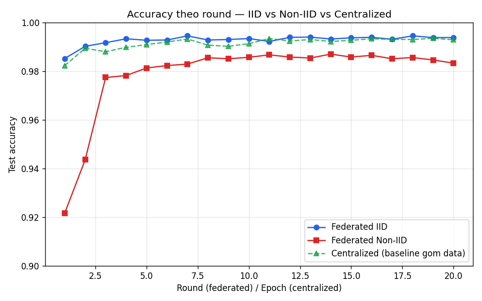
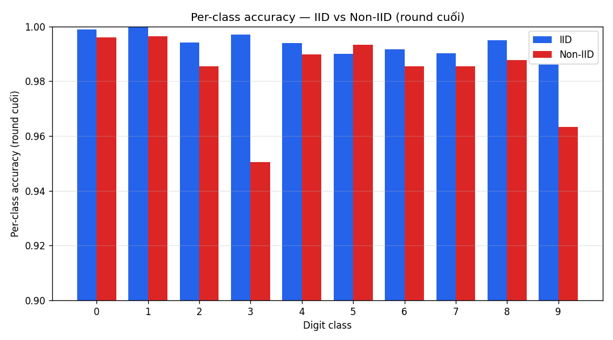
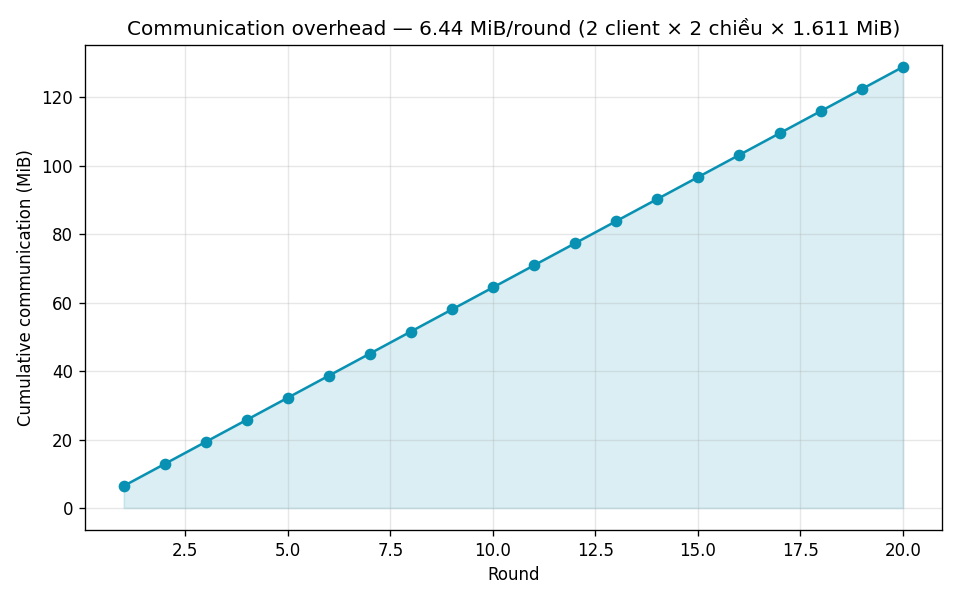
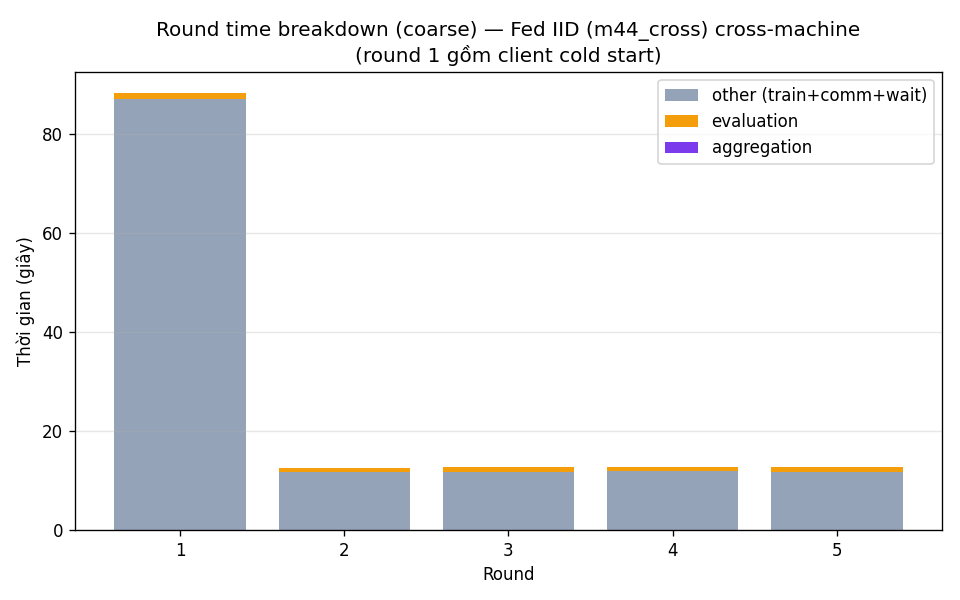

# Báo cáo cuối kỳ — Federated Learning Mini System

> Môn học: Hệ phân tán (Distributed Systems). Trọng tâm phân tích là **các vấn đề của hệ phân tán**, không phải tối ưu độ chính xác ML.

---

## 1. Tổng quan hệ thống

Hệ thống Federated Learning 2-node huấn luyện phân tán model phân loại chữ số MNIST mà **không tập trung dữ liệu thô** — mỗi client giữ shard riêng, chỉ gửi tham số model về server.

| Thành phần | Mô tả |
|---|---|
| **Hardware** | Máy 1 (Server + Client-0, RTX 2000 Ada) + Máy 2 (Client-1, RTX 2000 Ada), LAN |
| **Model** | CNN nhỏ: 2 conv (32, 64 filters) + 2 FC + dropout, ~422K tham số (state_dict 1.611 MiB) |
| **Thuật toán** | FedAvg — weighted average theo `num_samples` mỗi client |
| **Giao thức** | gRPC + Protocol Buffers, port 50051 |
| **State machine** | `TRAINING → AGGREGATING → EVALUATING → (next round | DONE)` |
| **Đồng bộ** | Bounded synchronous: chờ tối đa `WAIT_TIMEOUT`, aggregate khi đủ `MIN_CLIENTS` |

**3 RPC:** `GetGlobalModel` (client kéo model hiện tại), `SubmitUpdate` (client gửi update, 4 lớp validation: unknown_client → state_not_training → stale_round → duplicate), `GetRoundStatus` (poll trạng thái round).

Chi tiết kiến trúc + quá trình triển khai 7 milestone: xem [milestone_report.md](milestone_report.md).

## 2. Thiết lập thí nghiệm

**Hyperparams đồng nhất mọi run** (đảm bảo so sánh công bằng + tái lập):

```
local_epochs = 2     batch_size = 32     lr = 0.01     seed = 42
optimizer = SGD(momentum=0.9)            model = MnistCNN (1.611 MiB)
```

**Phân vai trò dữ liệu** (quan trọng để diễn giải đúng):
- **Accuracy/convergence**: baseline 20-round/epoch chạy localhost trên Máy 1 (Exp 1 & 2). Network không ảnh hưởng accuracy.
- **Timing/wall-clock**: lấy từ các run **cross-machine thật** (`m44_cross` cho normal federated; `m76_f1_v3` cho fault). Localhost 2 client tranh cùng GPU → wall-clock không phản ánh hệ thật, KHÔNG dùng làm kết luận performance.

**Phân hoạch dữ liệu:**
- IID: mỗi client 30000 samples, phân phối lớp đều (~3000/lớp).
- Non-IID pathological: Client-0 chỉ thấy digit **0-4** (30596 samples), Client-1 chỉ **5-9** (29404 samples) — kịch bản lệch phân phối cực đoan.

## 3. Experiment 1 — Centralized vs Federated

So sánh model huấn luyện tập trung (gom toàn bộ 60K samples về 1 máy) với Federated IID.

| Setup | Final accuracy | avg_acc round 1-5 | rounds→98% |
|---|---|---|---|
| Centralized (20 epoch) | 99.29% | 98.81% | 1 |
| Federated IID (20 round) | 99.38% | 99.06% | 1 |



**Nhận xét:**
- Federated IID đạt accuracy **ngang bằng** centralized (99.38% vs 99.29%) — với dữ liệu IID, việc phân tán không làm giảm chất lượng model. Đây là kết quả kỳ vọng: FedAvg trên dữ liệu phân phối đều xấp xỉ gradient descent tập trung.
- **Cost của phân tán** nằm ở communication (xem §7.1) và độ phức tạp đồng bộ (§7.2), không phải accuracy.
- Wall-clock: centralized 20 epoch = 156.7s (cục bộ, không network). Federated cross-machine steady-state ~12.7s/round (xem §7.1). KHÔNG so sánh trực tiếp tổng wall-clock như kết luận performance — hai mô hình khác bản chất đo (epoch toàn bộ data vs round với local epochs + network).

## 4. Experiment 2 — IID vs Non-IID (Data Heterogeneity)

Cùng cấu hình, chỉ đổi cách phân hoạch dữ liệu giữa 2 client.

| Setup | Final acc | avg_acc round 1-5 | rounds→98% |
|---|---|---|---|
| Federated IID | 99.38% | **99.06%** | 1 |
| Federated Non-IID | 98.33% | **96.04%** | 5 |

**Đường hội tụ** (xem hình §3): Non-IID khởi đầu chỉ **92.17%** ở round 1 (so với IID 98.52%), cần 5 round mới vượt 98%, và plateau ở mức thấp hơn (~98.5% vs ~99.4%).



**Nhận xét:**
- **Hội tụ chậm hơn rõ rệt:** `avg_acc_first_5` thấp hơn IID 3 điểm % (96.04 vs 99.06). Vì mỗi client chỉ thấy nửa số lớp, model cục bộ bị "kéo" về hướng riêng (client gradient divergence), FedAvg phải nhiều round hơn để dung hoà.
- **Lệch per-class:** ở round cuối, Non-IID kém nhất tại **class 3 (95.0%)** và **class 9 (96.3%)**, trong khi IID đều ~99% mọi lớp. Đây là dấu hiệu đặc trưng của data heterogeneity mà accuracy tổng (98.33%) che giấu một phần.
- Kết luận §7.5: dữ liệu không đồng đều giữa các node làm chậm hội tụ và giảm accuracy cuối — vấn đề **chỉ tồn tại trong Federated**, centralized không gặp vì đã gom data.

## 5. Experiment 3 — Straggler Problem

Inject delay nhân tạo (`--straggler-delay`) vào client trước khi `SubmitUpdate`, mô phỏng client chậm. Đo trên 2 kịch bản đối lập.

| Kịch bản | delay | wait_timeout | Kết quả | acc | wallclock/round |
|---|---|---|---|---|---|
| **S1 — Timeout đủ rộng** | 5s | 60s | 3/3 round `ok` (đủ 2 client) | 99.17% | ~15s |
| **S2 — Timeout chặt** | 20s | 20s | 3/3 round `partial` (drop straggler) | 98.85% | ~21s |

**Nhận xét:**
- **S1**: straggler chậm 5s nhưng server chờ được → mọi round vẫn `ok`. Tradeoff: `round_wallclock` tăng đúng ~5s/round (steady-state 15s = ~10s baseline + 5s delay). **Cả round bị kéo chậm theo client chậm nhất** — bản chất của bounded synchronous: tốc độ round = client chậm nhất nếu chờ đủ.
- **S2**: timeout (20s) ngắn hơn thời gian straggler (8s train + 20s sleep = 28s) → server **bỏ qua** straggler, aggregate với 1 client (`partial`). `round_wallclock ≈ 21s = wait_timeout` (timeout fired). Accuracy giảm nhẹ (98.85% vs 99.17%) vì mỗi round chỉ học từ nửa dữ liệu.
- **Tradeoff cốt lõi (§7.3):** chờ straggler → round chậm nhưng accuracy cao; drop straggler → round nhanh/đều nhưng accuracy giảm. WAIT_TIMEOUT là tham số điều chỉnh tradeoff này.

## 6. Experiment 4 — Fault Tolerance (Crash + Reconnect)

Cross-machine 16 round (`m76_f1_v3`). Manual Ctrl+C Client-1 trên Máy 2 giữa run, sau đó restart — mô phỏng crash + reconnect.

| Phase | Round | Trạng thái | Accuracy |
|---|---|---|---|
| Cold start | 1-2 | `partial` (Client-1 chưa join) | 98.3% |
| **Healthy** | 3-7 | `ok` (cả 2 client) | 99.22-99.36% |
| **Degraded** (Ctrl+C) | 8-11 | `partial` (chỉ Client-0) | 99.07-99.24% |
| **Recovery** (restart) | 12-16 | `ok` (Client-1 rejoin) | 99.28-**99.41%** |

**Bằng chứng từ log:** `events.csv` ghi `update_received` của Client-1 ở round 3-7, rồi **gap round 7→12 (~3 phút)** đúng cửa sổ crash, rồi tiếp tục round 12-16. Server **không hề dừng** suốt giai đoạn degraded — tiếp tục aggregate với 1 client (`partial_aggregation`, `round_wallclock ≈ 46s = wait_timeout`).

**Nhận xét (§7.4):**
- Server **chịu lỗi**: 1 client crash không làm sập hệ thống nhờ `MIN_CLIENTS=1` + cơ chế `WAIT_TIMEOUT` → fallback partial aggregation.
- **Không degrade accuracy:** sau recovery, accuracy đạt đỉnh 99.41% — model không bị hỏng bởi crash/recovery cycle. Các round `partial` vẫn giữ accuracy ~99% vì Client-0 (IID) đủ dữ liệu đại diện.
- Mọi sự kiện được **log rõ ràng** (round_timeout, partial_aggregation, update_received) — đáp ứng yêu cầu observability của spec §7.4.

## 7. Phân tích 5 vấn đề Distributed Systems

### 7.1 Communication Overhead



```
model_size = 1,689,280 bytes = 1.611 MiB (state_dict serialized)
comm/round = 1.611 MiB × 2 (download + upload) × 2 client = 6.44 MiB
20 round   = 128.9 MiB
```

- Chi phí truyền **tuyến tính theo số round và số client**. Với mô hình lớn hơn (ResNet, BERT) con số này bùng nổ → đây là nút thắt chính của Federated Learning thực tế.
- **Breakdown thời gian round** (cross-machine steady-state, hình dưới): phần lớn là client train + communication (~11.7s), evaluation ~0.98s, **aggregation chỉ ~2.1ms** (gần như vô hình). → Round time bị chi phối bởi **client compute + truyền model**, không phải xử lý server-side.



- **gRPC/protobuf vs HTTP+JSON:** protobuf serialize binary trực tiếp từ `state_dict` bytes, không text parsing. JSON sẽ phải base64-encode tensor (~+33% kích thước) + parse text → chậm và tốn băng thông hơn. gRPC còn dùng HTTP/2 multiplexing.
- **Future Work:** weight delta (chỉ gửi thay đổi), top-k sparsification, int8 quantization (giảm ~4× kích thước) — đều đánh đổi accuracy/độ phức tạp, thảo luận ngoài scope.

### 7.2 Synchronization Model

Hệ dùng **bounded synchronous**:
- **Có timeout** → không bị block vô hạn bởi client treo (khác synchronous thuần).
- **Vẫn chờ đủ `MIN_CLIENTS`** trước khi aggregate (khác asynchronous hoàn toàn).
- **Tradeoff** (minh chứng bằng Exp 3): `WAIT_TIMEOUT` lớn → chờ được straggler, accuracy cao nhưng round chậm; nhỏ → round nhanh/đều nhưng drop straggler, accuracy giảm.
- Background aggregation thread + 3-phase lock design (snapshot → heavy work no-lock → guarded commit) đảm bảo correctness mà không giữ lock trong lúc eval nặng (chi tiết M6 trong milestone_report).

### 7.3 Straggler Problem

Đã đo trong Exp 3. Kết luận: trong bounded-sync, **tốc độ round = client chậm nhất** (nếu chờ); WAIT_TIMEOUT cho phép "cắt đuôi" straggler để giữ nhịp round, đổi lại mất update của client đó trong round. Đây là lý do real-world FL thường dùng client sampling + deadline thay vì chờ tất cả.

### 7.4 Fault Tolerance

Đã đo trong Exp 4. Kết luận: kết hợp `MIN_CLIENTS=1` + `WAIT_TIMEOUT` + partial aggregation cho phép hệ **degrade gracefully** khi client crash và **tự phục hồi** khi client reconnect, không cần can thiệp server. Mọi transition được log để truy vết.

### 7.5 Data Heterogeneity (Non-IID)

Đã đo trong Exp 2. Kết luận: dữ liệu lệch phân phối giữa các node làm **chậm hội tụ** (avg_first5 thấp hơn 3%) và **giảm accuracy cuối** + **lệch per-class**. Đây là vấn đề riêng của Federated (centralized gom data nên không gặp). Trong thực tế (dữ liệu người dùng tự nhiên Non-IID), đây là thách thức trung tâm — các thuật toán như FedProx, SCAFFOLD ra đời để giảm client drift.

## 8. Future Work

- **Communication:** gradient compression, quantization, weight delta.
- **Heterogeneity:** FedProx (proximal term), SCAFFOLD (control variates) giảm client drift.
- **Sync:** asynchronous FL, client sampling theo deadline.
- **Bảo mật:** secure aggregation, differential privacy (hiện gửi raw weights — có thể rò rỉ thông tin).
- **Scale:** mở rộng >2 client, đo scaling của communication + aggregation.

## 9. Kết luận

Hệ thống đã hiện thực hoá đầy đủ một Federated Learning mini system 2-node với gRPC + FedAvg, và **chứng minh bằng thực nghiệm cả 5 vấn đề distributed systems** trọng tâm:

1. **Communication overhead** tuyến tính (6.44 MiB/round), round time bị chi phối bởi client compute + truyền model chứ không phải aggregation.
2. **Synchronization** bounded-sync với tradeoff điều chỉnh được qua WAIT_TIMEOUT.
3. **Straggler**: chờ (round chậm, acc cao) vs drop (round nhanh, acc giảm) — đo trực tiếp ở Exp 3.
4. **Fault tolerance**: crash/recovery không làm sập hệ hay hỏng model — đo ở Exp 4.
5. **Data heterogeneity**: Non-IID làm chậm hội tụ + lệch per-class — đo ở Exp 2.

Với dữ liệu IID, Federated đạt accuracy ngang centralized (99.38% vs 99.29%) — cho thấy chi phí của phân tán nằm ở **communication + đồng bộ + xử lý lỗi**, đúng trọng tâm môn học, chứ không phải ở chất lượng model.

---

*Phụ lục: chi tiết triển khai 7 milestone (M1-M7) trong [milestone_report.md](milestone_report.md); kế hoạch thí nghiệm trong [experiments_plan.md](experiments_plan.md); script phân tích `analyze.py`.*
