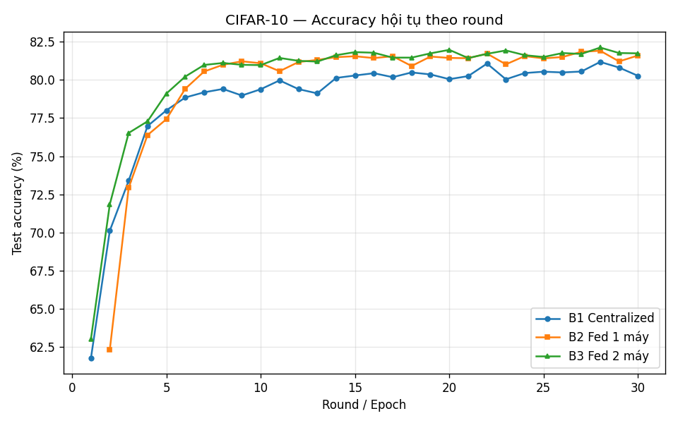
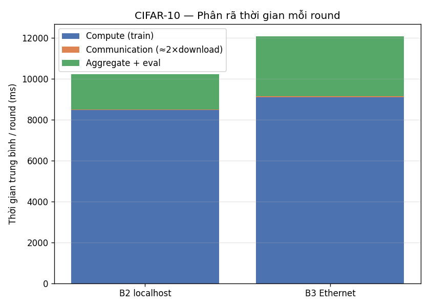
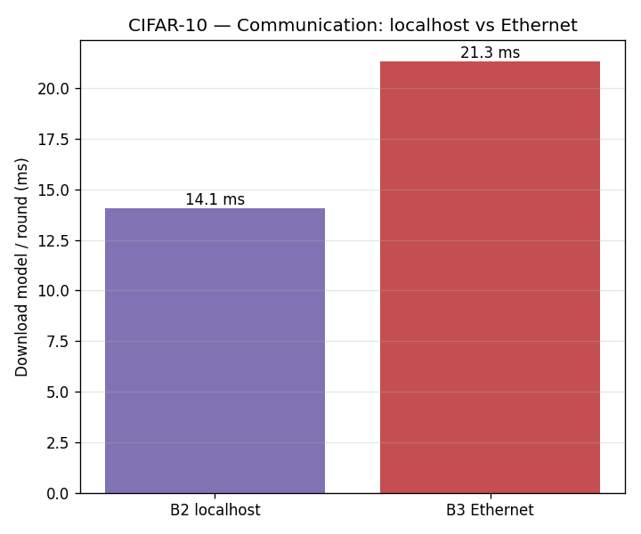
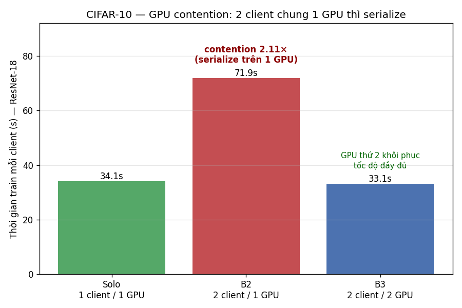
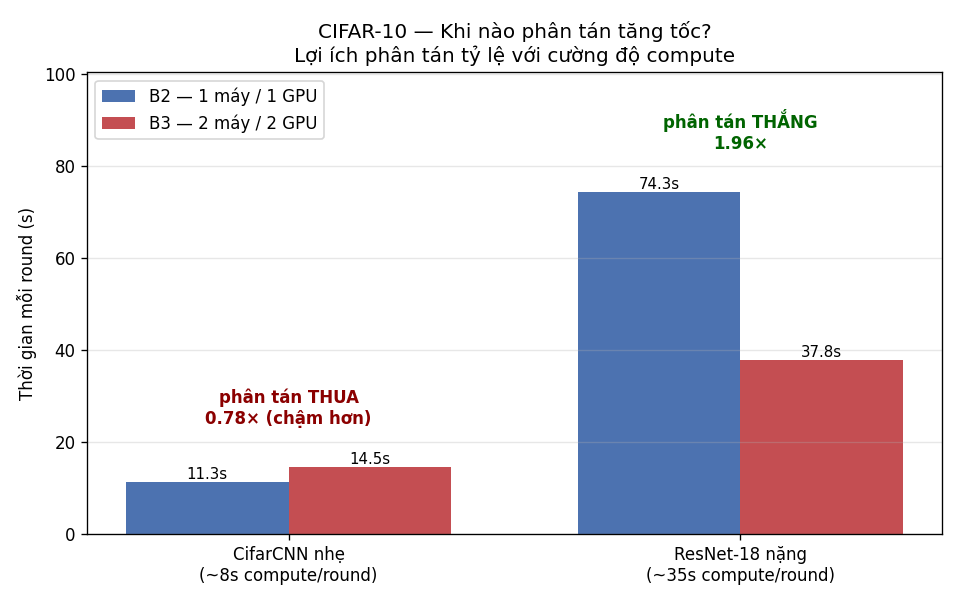

# BÁO CÁO CUỐI KỲ — HPC for AI

## Huấn luyện AI phân tán trên hệ 2-node với gRPC + FedAvg
### Khi nào phân tán tăng tốc? Nút cổ chai ở đâu?

**Trọng tâm phân tích — hiệu năng song song:** Speedup · Efficiency · Strong scaling · Định luật Amdahl · Định vị bottleneck (compute / communication / synchronization)

**Bàn thử nghiệm:** hệ Federated Learning 2-node, dataset CIFAR-10, hai chế độ compute (CifarCNN nhẹ · ResNet-18 nặng).

> Mọi số liệu trong báo cáo lấy trực tiếp từ `Report/data/*/round_log.csv` (đo bằng `time.perf_counter`, đơn điệu, độc lập đồng hồ hệ thống). Script phân tích: `analyze_cifar.py` (baseline nhẹ) và `analyze_heavy.py` (scaling nặng). Xem Phụ lục A để tra run-id → số liệu.

---

## Mục lục

1. Giới thiệu — bối cảnh, câu hỏi nghiên cứu, đóng góp
2. Cơ sở lý thuyết — data parallelism, FedAvg, khái niệm HPC, phân loại bottleneck
3. Thiết kế hệ thống — kiến trúc 2 node, đồng bộ, mô hình & dữ liệu, instrumentation
4. Thiết lập thực nghiệm — phần cứng, mạng, các kịch bản
5. Hiệu năng nền (baseline nhẹ) — accuracy, thời gian, phân rã round, vì sao comm không phải bottleneck
6. Tối ưu hiệu năng — rendezvous, overlap eval, polling, load balancing
7. Nghiên cứu khả năng mở rộng (scaling nặng) — GPU contention, scale-up, strong scaling
8. Thảo luận — bài học HPC, hạn chế, hướng mở rộng
9. Kết luận · Tài liệu tham khảo · Phụ lục

---

## 1. Giới thiệu

### 1.1 Bối cảnh: huấn luyện AI phân tán & nhu cầu HPC

Huấn luyện các mô hình deep learning hiện đại đòi hỏi lượng tính toán tăng nhanh hơn năng lực của một GPU đơn lẻ. Khi kích thước mô hình và dữ liệu vượt ngưỡng một thiết bị, việc **phân tán tính toán qua nhiều node** trở thành yêu cầu bắt buộc — đây là giao điểm giữa Machine Learning và High-Performance Computing (HPC).

Tuy nhiên, phân tán không "miễn phí". Nó thêm hai loại chi phí không có trong huấn luyện đơn máy: **truyền thông** (đồng bộ tham số model qua mạng) và **đồng bộ hoá** (chờ các node cùng nhịp). Nếu phần tính toán được song song hoá không đủ lớn để lấn át hai chi phí này, phân tán có thể **chậm hơn** đơn máy — đúng như định luật Amdahl dự báo.

Báo cáo xây dựng một hệ **Federated Learning 2-node** hoàn chỉnh (gRPC + FedAvg) và dùng nó để trả lời một câu hỏi HPC cốt lõi: **khi nào việc thêm một máy thứ hai thực sự làm huấn luyện nhanh hơn, và khi nào không?**

### 1.2 Câu hỏi nghiên cứu

1. **Khi nào phân tán tăng tốc?** Thực nghiệm cho thấy câu trả lời phụ thuộc cường độ compute: với mô hình nhẹ (CifarCNN, ~620K tham số), hệ 2 máy **chậm hơn** 1 máy (14.48s vs 11.34s mỗi round). Điều gì quyết định chiều của kết quả?
2. **Nút cổ chai ở đâu?** Chi phí truyền thông có phải rào cản chính như trực giác thường nghĩ, hay bottleneck thật nằm chỗ khác?
3. **Làm sao để phân tán thắng?** Cần điều kiện gì về khối lượng tính toán, và những tối ưu hệ thống nào?

### 1.3 Đóng góp chính

1. **Một hệ FL 2-node được đo đạc chi tiết:** kiến trúc server–client gRPC/protobuf với FedAvg, đồng bộ *bounded-synchronous* + *rendezvous barrier*, và **instrumentation phân rã thời gian mỗi round** (compute / communication / aggregation / evaluation) — quy trách nhiệm từng phần thời gian thay vì chỉ đo tổng.
2. **Chứng minh lợi ích phân tán tỷ lệ với cường độ compute.** Mô hình nhẹ: phân tán **thua** 1.28×. Mô hình nặng (ResNet-18, ~11M tham số, làm bão hoà GPU): phân tán **thắng 1.96×** (hiệu suất song song 98%), đo bằng strong scaling.
3. **Định vị đúng nút cổ chai.** Bác bỏ trực giác "truyền thông là rào cản": communication chỉ chiếm **~0.3%** (model nhẹ) đến **~2%** (model nặng) thời gian round. Bottleneck thật là **tranh chấp GPU** — đo được **2.11×** khi 2 client dùng chung một GPU.
4. **Bốn tối ưu hệ thống có kiểm chứng** (rendezvous barrier: round đầu **89.6s → 11.0s**; overlap eval khỏi đường găng: giấu ~15s eval ResNet; giảm poll-wait; cân bằng tải bằng shard weighting) **triệt tiêu chi phí phân tán**: chênh round-time B3−B2 (model nhẹ) thu hẹp **3.14s → 0.08s**.
5. **Bài học HPC tổng quát:** kết quả minh hoạ định luật Amdahl — chỉ song song hoá cái đang là bottleneck; phân tán đáng giá khi phần compute song song hoá được đủ lớn để lấn át chi phí điều phối tuần tự.

---

## 2. Cơ sở lý thuyết

### 2.1 Data parallelism trong huấn luyện Deep Learning

Trong *data parallelism*, mỗi worker giữ một bản sao model và một phần khác nhau của dữ liệu. Mỗi worker tính gradient/cập nhật cục bộ trên phần dữ liệu của mình, rồi các cập nhật được tổng hợp để tạo model chung mới. Đây là hình thức song song phổ biến nhất khi model vừa một GPU nhưng dữ liệu lớn — đối lập với *model parallelism* (chia model qua nhiều thiết bị).

### 2.2 Federated Learning & thuật toán FedAvg

Federated Learning (FL) là một dạng data parallelism đặc biệt: dữ liệu **không** được gom về trung tâm, mỗi client giữ shard riêng và chỉ gửi *tham số model* về server. Thuật toán trung tâm là **FedAvg** (McMahan et al., 2017): sau khi mỗi client huấn luyện `E` epoch cục bộ, server lấy **trung bình có trọng số** theo số mẫu:

$$ w_{t+1} = \sum_{k=1}^{K} \frac{n_k}{n} \, w_{t+1}^{k} $$

với $n_k$ là số mẫu của client $k$, $n = \sum_k n_k$. FL vừa là bài toán HPC (song song hoá compute) vừa mang các đặc trưng hệ phân tán (đồng bộ, chịu lỗi) — phù hợp làm bàn thử nghiệm cho câu hỏi của báo cáo.

### 2.3 Khái niệm HPC: speedup, efficiency, scaling, Amdahl

- **Speedup**: $S_p = T_1 / T_p$ — thời gian trên 1 đơn vị tính toán chia thời gian trên $p$ đơn vị.
- **Efficiency**: $E_p = S_p / p$ — speedup chuẩn hoá; $E_p = 1$ (100%) là song song lý tưởng.
- **Strong scaling**: cố định **tổng** khối lượng bài toán, tăng số processor, đo speedup. (Báo cáo dùng cách này ở §7.3.)
- **Weak scaling**: tăng khối lượng tỷ lệ với số processor.
- **Định luật Amdahl**: nếu phần tuần tự (không song song hoá được) chiếm tỷ lệ $s$, thì $S_p = \dfrac{1}{s + (1-s)/p}$. Speedup bị chặn trên bởi $1/s$ dù $p \to \infty$. Với hệ 2-node, $s$ chính là chi phí điều phối (mạng + đồng bộ + phần server tuần tự).

> **Lý thuyết ↔ đo đạc khớp nhau (xem trước §7.3):** ở chế độ compute nặng, ta đo được $S_2 = 1.96$. Giải ngược Amdahl cho $p=2$: $1.96 = 1/(s + (1-s)/2) \Rightarrow s \approx 2.0\%$. Con số phần-tuần-tự **suy ra từ speedup** này trùng gần như hoàn hảo với **communication đo trực tiếp (~2.09%)** — bằng chứng độc lập rằng chi phí điều phối chính là communication + đồng bộ, đúng như mô hình Amdahl dự báo.

### 2.4 Phân loại nút cổ chai

- **Compute-bound**: thời gian bị chi phối bởi tính toán (GPU). Phân tán giúp *nếu* compute có thể chạy song song thật.
- **Communication-bound**: bị chi phối bởi truyền dữ liệu qua mạng. Phân tán thêm node có thể phản tác dụng.
- **Synchronization-bound**: bị chi phối bởi việc chờ đồng bộ (barrier, straggler). Cân bằng tải + overlap là chìa khoá.

Một trong các mục tiêu của báo cáo là **đo** xem hệ rơi vào loại nào, thay vì giả định.

---

## 3. Thiết kế hệ thống

### 3.1 Kiến trúc 2 node (server–client, gRPC/protobuf)

Hệ gồm **1 server** (điều phối + tổng hợp + đánh giá) và **2 client** (huấn luyện cục bộ). Giao tiếp qua **gRPC + Protocol Buffers** trên port `50051`, với 3 RPC chính: `GetGlobalModel` (client kéo model hiện tại), `SubmitUpdate` (client gửi update), `GetRoundStatus` (poll trạng thái round). Protobuf serialize `state_dict` thành binary trực tiếp — không text-parsing, nhỏ gọn hơn JSON.

Trong thí nghiệm 2 máy: **Máy 1** (`admin`) chạy server + client-0, **Máy 2** (`ADMIN`) chạy client-1. Việc Máy 1 kiêm cả server khiến client-0 chịu thêm tải điều phối — một chi tiết quan trọng cho phân tích straggler (§6.4).

### 3.2 Mô hình đồng bộ: bounded-synchronous + rendezvous barrier

- **Bounded-synchronous**: server chờ tối đa `wait_timeout` mỗi round; aggregate khi đủ `min_clients`. Không block vô hạn (khác synchronous thuần), nhưng vẫn chờ đủ số client (khác asynchronous).
- **Rendezvous barrier** (§6.1): server **không bắt đầu bấm giờ round 1** cho tới khi **đủ 2 client đăng ký**. Nếu thiếu barrier này, client vào trễ khiến round đầu gánh toàn bộ độ lệch khởi động (Python/CUDA warmup), làm nhiễu phép đo.

### 3.3 Mô hình & dữ liệu

| | CifarCNN (nhẹ) | CifarResNet — ResNet-18 (nặng) |
|---|---|---|
| Kiến trúc | 3 conv (32/64/128) + 2 FC | ResNet-18 (conv 64 + 4 stage residual + FC 512) |
| Tham số (đếm thật) | 620,810 (~620K) | 11,173,962 (~11.2M) |
| Payload state_dict | 2.38 MiB (2,492,491 B) | **42.7 MiB** (44,774,014 B) |
| Vai trò | baseline, GPU **không** bão hoà | scale-up, làm **bão hoà** GPU |

Dữ liệu: **CIFAR-10** (50.000 train / 10.000 test, ảnh màu 3×32×32). Phân hoạch IID: mỗi client 25.000 mẫu, phân phối lớp đều. Hyperparams **cố định**: `batch_size=32, lr=0.01, SGD(momentum=0.9), seed=42`. Riêng khối lượng compute mỗi round thay đổi **có chủ đích** theo chế độ để kiểm chứng giả thuyết cường độ compute:

| Chế độ | local_epochs | num_rounds |
|---|---|---|
| Nhẹ (CifarCNN) | 2 | 30 |
| Nặng (ResNet-18) | 1 | 3–10 (solo 3 / B2 4 / B3 10) |

Việc chế độ nặng chỉ dùng **1 local epoch** mà round vẫn nặng gấp ~4× (một epoch ResNet ~34s so với hai epoch CifarCNN ~8s) càng nhấn mạnh chênh lệch cường độ compute giữa hai model.

### 3.4 Instrumentation: đo phân rã thời gian mỗi round

Mỗi round, hệ ghi vào `round_log.csv`: `round_wallclock_sec` (tổng), `client_*_download_ms` (truyền model server→client), `client_*_train_ms` (compute cục bộ), `aggregation_time_ms`, `eval_time_ms`, cùng `accuracy` + `model_bytes`. Riêng **upload** chỉ đo được phía client (stdout) vì nó là thời lượng của chính lời gọi `SubmitUpdate` — server không quan sát trực tiếp. Cách phân rã này cho phép **quy trách nhiệm** từng ms cho compute / comm / sync — nền tảng cho mọi kết luận bottleneck bên dưới.

---

## 4. Thiết lập thực nghiệm

### 4.1 Phần cứng & phần mềm

Hai máy dùng **GPU giống hệt**: NVIDIA **RTX 2000 Ada Generation**, Windows. Tuy nhiên **software stack khác nhau** (theo `run_meta.json`):

| | GPU | PyTorch | CUDA |
|---|---|---|---|
| Máy 1 (server + client-0) | RTX 2000 Ada | **2.5.1+cu121** | **12.1** |
| Máy 2 (client-1) | RTX 2000 Ada | 2.6.0+cu124 | 12.4 |

GPU đồng nhất đảm bảo so sánh 1-máy vs 2-máy công bằng ở tầng phần cứng. **Lưu ý confound (xem §8):** Máy 1 chạy PyTorch cũ hơn (2.5.1 vs 2.6.0), nên một phần độ lệch "Máy 1 chậm hơn" (straggler) có thể đến từ **cả** phiên bản phần mềm **lẫn** tải server co-located — hai biến này chưa được tách trong thí nghiệm hiện tại.

### 4.2 Mạng: Ethernet trực tiếp 2.5GbE

Hai máy nối trực tiếp bằng cáp Ethernet, đặt IP tĩnh `10.0.0.1/24` (Máy 1) và `10.0.0.2/24` (Máy 2).
- **Latency**: ping steady-state **< 1ms** (round đầu spike do ARP — bình thường).
- **Throughput thô**: đo bằng `tools/throughput_test.py` (gửi 1 GB qua socket TCP thuần): **281.9 MB/s = 2.36 Gbps**, khớp kỳ vọng link 2.5GbE.

Con số throughput này quan trọng cho phân tích §5.4: link **thừa** băng thông so với nhu cầu truyền model.

### 4.3 Các kịch bản

| Mã | Mô tả | GPU | Vai trò |
|---|---|---|---|
| **B1** | Centralized (gom toàn bộ data, 1 process) | 1 | baseline tốc độ train thuần |
| **B2** | Federated, server + 2 client cùng 1 máy | 1 (dùng chung) | đo overhead gRPC + tranh GPU |
| **B3** | Federated, 2 máy qua Ethernet | 2 (riêng) | đo communication + song song thật |

**Model nhẹ** chạy đủ B1/B2/B3 (30 round) cho phân tích baseline (Chương 5). **Model nặng** (Chương 7) tập trung vào scaling nên dùng 3 cấu hình: `solo` (1 client / 1 GPU — baseline đơn worker), B2 (2 client / 1 GPU), B3 (2 client / 2 GPU); số round khác nhau do giới hạn thời gian (B3 = 10, B2 = 3, solo = 2 round) nên **chỉ so `round_wallclock` steady-state**, không so accuracy giữa chúng. So sánh cốt lõi: **B2 (1 GPU) vs B3 (2 GPU)** trên cùng khối lượng bài toán = strong scaling.

---

## 5. Phân tích hiệu năng nền (Baseline — CifarCNN nhẹ)

### 5.1 Độ chính xác & tính đúng đắn khi phân tán

| Kịch bản | best acc | final acc |
|---|---|---|
| B1 Centralized | 81.17% | 80.26% |
| B2 Federated 1 máy | 82.24% | 81.97% |
| B3 Federated 2 máy | 82.11% | 81.73% |

Ba kịch bản đạt accuracy **ngang nhau** (~81–82%). Với dữ liệu IID, FedAvg xấp xỉ tốt gradient descent tập trung — **phân tán không làm giảm chất lượng model**. Kết luận: chi phí của phân tán nằm ở *thời gian/điều phối*, không ở accuracy.

### 5.2 Thời gian huấn luyện: 1 máy vs 2 máy

| Kịch bản | Thời gian / round |
|---|---|
| B1 Centralized | 7.92s / epoch (tổng 237.6s) |
| **B2 Federated 1 máy** | **11.34s** |
| **B3 Federated 2 máy** | **14.48s** |

**Phát hiện phản trực giác:** với model nhẹ, **B3 (2 máy) CHẬM HƠN B2 (1 máy)** — 14.48s vs 11.34s, tức phân tán **thua 1.28×**. Thêm một GPU lại làm chậm đi. Vì sao? Model nhẹ (train ~8s) **không làm bão hoà GPU**, nên khi 2 client dùng chung 1 GPU (B2) chúng không serialize nhiều; trong khi B3 phải gánh thêm communication qua mạng + độ lệch đồng bộ giữa 2 máy (đặc biệt straggler Máy 1 kiêm server, §6.4). Đây là minh hoạ trực tiếp cho định luật Amdahl: khi phần song song hoá quá nhỏ, chi phí điều phối lấn át.

### 5.3 Phân rã round: compute vs communication vs synchronization

Phân rã round của B3 nhẹ (14.48s):

| Thành phần | Thời gian | Ghi chú |
|---|---|---|
| Compute (client train) | ~10.4s | **bị chặn bởi client chậm nhất** (client-0/Máy 1 = 10.4s; client-1/Máy 2 = 7.9s) |
| Communication (download+upload) | ~40ms | download 21ms + upload ~20ms |
| Aggregation (server) | ~4ms | gần như vô hình |
| Evaluation (server) | ~2.9s | chạy nền, chồng lấp một phần |
| Sync/polling overhead | phần còn lại | rendezvous, poll status |

Round bị chi phối bởi **client chậm nhất** (bounded-synchronous): dù client-1 train xong ~7.9s, round vẫn phải chờ client-0 ~10.4s — chính là straggler Máy 1 kiêm server (xử lý ở §6.4).

### 5.4 Vì sao communication KHÔNG phải nút cổ chai

Communication chỉ chiếm **~0.3%** thời gian round (40ms / 14480ms). Lý do định lượng: model 2.38 MiB, link 281.9 MiB/s → truyền thuần chỉ tốn ~9ms; đo thực tế download ~21ms (thêm overhead gRPC/latency).

**Băng thông không phải rào cản** — link 2.5GbE thừa sức. Trực giác "truyền model là bottleneck của FL" **sai** trong bối cảnh này; bottleneck thật là **compute** (và ở B3, thêm **đồng bộ**). Đây là kết quả then chốt định hướng toàn bộ phần tối ưu: phải tấn công compute + sync, không phải communication.

*Ghi chú đo lường:* upload qua Ethernet có phân phối **bimodal** (~20ms phần lớn round, đôi khi spike ~370–430ms), do tương tác Nagle/delayed-ACK ở tầng TCP với payload nhỏ — một hiện tượng jitter thú vị nhưng không đổi kết luận (comm vẫn <1% round).

---

## 6. Tối ưu hiệu năng

### 6.1 Rendezvous barrier — loại startup latency

**Vấn đề:** không có barrier, client-1 (Máy 2) khởi động chậm (Python + torch + CUDA + tải CIFAR ~1 phút) khiến round 1 gánh toàn bộ độ lệch này.

**Đo được:** round 1 của B3 **không** rendezvous = **89.63s**; sau khi thêm rendezvous (server chờ đủ 2 client mới bấm giờ) = **10.96s**. Giảm **~8.2×** ở round đầu, và quan trọng hơn là **loại nhiễu** khỏi phép đo steady-state.

### 6.2 Overlap compute–communication (eval off critical path)

Server chạy **evaluation trong luồng nền** (background aggregation thread, thiết kế 3-pha: snapshot → heavy work không giữ lock → commit có guard), để client bắt đầu train round kế trong khi server còn đang đánh giá.

**Bằng chứng định lượng mạnh nhất — model nặng:** ResNet eval tốn **~15.3s**/round. Nếu eval nằm trên đường găng, round B3 nặng phải là ~36.5s (train) + 15.3s (eval) ≈ **52s**. Thực đo round chỉ **37.8s** ≈ train 36.5s + comm 1.1s — **eval 15s bị giấu hoàn toàn**. Overlap tiết kiệm **~27%** thời gian round ở chế độ nặng (52s → 37.8s).

### 6.3 Giảm polling latency

Client poll trạng thái round mỗi `POLL_INTERVAL_SEC`. Với giá trị cũ **2.0s**, sau khi server sang round mới, client có thể **chờ tới ~2s** mới phát hiện và pull model — khoản trễ này cộng thẳng vào `round_wallclock`. Giảm **2.0s → 0.5s** cắt độ trễ phát hiện còn ~0.5s, tiết kiệm ~1–1.5s mỗi round. Đây **không** phải tối ưu compute (train vẫn ~8–10s) mà là cắt **độ trễ điều phối**; cùng với overlap eval (§6.2), nó tạo nên phần lớn cải thiện của "opt-A" (§6.5).

### 6.4 Cân bằng tải bằng shard weighting (load balancing)

**Vấn đề straggler nội tại:** dù chia shard **đều 50/50**, Máy 1 chậm hơn vì kiêm server + aggregation + eval. Đo độ lệch hoàn thành giữa 2 client (|train_c0 − train_c1|):

| Cấu hình shard (cùng opt-A) | mean \|skew\| | Diễn giải |
|---|---|---|
| Đều 50/50 | **1.86s** | client-0 (Máy 1) là straggler cố định |
| Cân 45/55 | **1.21s** | giảm 37%, nhưng **over-correct** (đổi dấu: client-1 giờ chậm hơn) |

> So sánh táo-táo: cả hai đều đã áp opt-A (run `m1_opt5` vs `m1_optB`) để cô lập đúng tác động của
> shard weighting. (Ở baseline chưa opt-A, straggler còn nặng hơn — skew tới **2.57s** trong `m1_rv2` —
> nhưng phần đó thuộc về opt-A/nhiễu, không nên gộp vào hiệu quả cân tải.)

Cho client-0 ít dữ liệu hơn (45%) để bù tải server là **đúng hướng** và giảm lệch **~37%**. Nhưng tỷ lệ 45/55 **quá tay** — độ lệch đổi dấu (client-1 giờ chậm hơn), điểm tối ưu nằm khoảng ~48/52. Đây là minh hoạ kinh điển của *load balancing* trong HPC: cân theo **năng lực thực** của node (đã trừ overhead), không theo số lượng danh nghĩa.

### 6.5 Kết quả: triệt tiêu chi phí điều phối (chênh B3−B2: 3.14s → 0.08s)

Thước đo trực tiếp "chi phí phân tán" (model nhẹ) là **chênh lệch round-time giữa B3 (2 máy) và B2 (1 máy)**. Tổng hợp tác động các tối ưu:

| Giai đoạn | B2 round | B3 round | Chênh B3−B2 |
|---|---|---|---|
| Baseline (chỉ rendezvous) | 11.34s | 14.48s | **+3.14s** (phân tán thua 1.28×) |
| + opt-A (overlap eval §6.2 + poll 0.5s §6.3) | 9.73s | 10.66s | +0.93s |
| + opt-B (cân bằng shard 45/55 §6.4) | 9.73s | 9.81s | **+0.08s** (≈ hoà) |

Chi phí phân tán **thu hẹp 3.14s → 0.08s** — gần triệt tiêu. Mọi cải thiện đến từ cắt **overhead điều phối** (eval on-path, poll-wait, load imbalance), **không** đụng communication (vẫn ~0.3% suốt hành trình). Riêng rendezvous (§6.1) loại độ lệch khởi động (round đầu 89.6s→11.0s); ở chế độ nặng overlap eval giấu ~15s/round (§6.2), đưa hiệu suất song song lên **98%** (§7.3).

**Nhưng "hoà" chưa phải "thắng".** Với model nhẹ, tối ưu tốt nhất chỉ đưa phân tán về **ngang** 1 máy — vì GPU chưa bão hoà nên không có compute song song để giành. Đây chính là động lực chuyển sang model nặng (Chương 7), nơi phân tán mới thực sự **thắng 1.96×**.

---

## 7. Nghiên cứu khả năng mở rộng (Scaling study)

### 7.1 GPU contention & compute intensity

Câu hỏi: khi 2 client dùng **chung 1 GPU** (B2), chúng chạy song song hay serialize? Đo bằng model nặng (ResNet-18):

| Cấu hình | train / client |
|---|---|
| T1 — 1 client / 1 GPU (solo) | **34.1s** |
| T2 — 2 client / 1 GPU (B2 nặng) | **71.9s** |
| 2 client / 2 GPU (B3 nặng) | **33.1s** |

Tỷ lệ **T2 / T1 = 71.9 / 34.1 = 2.11×** (đo bằng test contention localhost chuyên biệt; data commit solo/b2b cho 2.09× — khớp trong nhiễu). Khi GPU đã bão hoà bởi một client, thêm client thứ hai trên **cùng** GPU khiến mỗi client chậm gấp đôi — chúng **serialize**, không song song. Cấp cho mỗi client một GPU riêng (B3) khôi phục tốc độ về ~33s (≈ solo). Đây chính là bottleneck mà model nhẹ (§5.2) che giấu (vì GPU chưa bão hoà nên contention < 2×).

### 7.2 Scale-up model (ResNet-18): khi nào phân tán thắng

Với ResNet-18 làm bão hoà GPU, so sánh B2 (1 GPU) vs B3 (2 GPU) trên cùng khối lượng:

| Kịch bản | round_wallclock (steady) | train/client |
|---|---|---|
| **B2 nặng** (2 client / 1 GPU) | **74.28s** | ~72s (serialize) |
| **B3 nặng** (2 client / 2 GPU) | **37.83s** | c0 36.5s / c1 29.7s |

Ở chế độ nặng, mỗi GPU chạy đúng 1 client ở tốc độ đầy đủ (~34–36s), thay vì serialize 72s. **Phân tán thắng rõ rệt.**

### 7.3 Strong scaling: speedup & hiệu suất song song

$$ S_2 = \frac{T_{B2}}{T_{B3}} = \frac{74.28}{37.83} = \mathbf{1.96\times}, \qquad E_2 = \frac{S_2}{2} = \mathbf{98\%} $$

Speedup **1.96×** trên 2 GPU với hiệu suất **98%** — gần lý tưởng. Suy ngược định luật Amdahl: $1.96 = 1/(s + (1-s)/2) \Rightarrow s \approx 2\%$. Chỉ ~2% thời gian là tuần tự (mạng + đồng bộ + phần server) — phần còn lại song song hoá gần hoàn hảo, nhờ các tối ưu ở Chương 6.

*Ghi chú:* B3 nặng chạy 10 round (đạt acc 84.71%), B2 nặng chỉ 3 round — **không** so sánh accuracy giữa hai (khác số round); chỉ so **round_wallclock** cho scaling. Straggler nhẹ còn lại: client-0 (Máy 1) train 36.5s > client-1 29.7s, đúng như phân tích §6.4 (Máy 1 kiêm server).

### 7.4 Kết luận scaling: lợi ích phân tán tỷ lệ với độ nặng compute

| Model | Compute/round | B2 (1 GPU) | B3 (2 GPU) | Kết quả phân tán |
|---|---|---|---|---|
| CifarCNN nhẹ | ~8s | 11.34s | 14.48s | **thua 1.28×** |
| ResNet-18 nặng | ~35s | 74.28s | 37.83s | **thắng 1.96×** |

Cùng một hệ thống, cùng phần cứng — chỉ đổi độ nặng model — chuyển từ "phân tán thua" sang "phân tán thắng gần lý tưởng". **Điều kiện để phân tán tăng tốc: compute phải đủ nặng để bão hoà GPU đơn**, khi đó tranh chấp GPU (2.11×) trở thành bottleneck mà GPU thứ hai giải phóng, và phần compute song song đủ lớn để lấn át chi phí điều phối (Amdahl).

---

## 8. Thảo luận

### 8.1 Bài học HPC

- **Amdahl là có thật và đo được:** cùng hệ thống, phân tán thắng hay thua tuỳ tỷ lệ compute/điều phối. Model nhẹ → phần tuần tự (mạng+sync) lấn át → thua. Model nặng → phần song song (compute) lấn át → thắng 1.96×.
- **Định vị bottleneck trước khi tối ưu:** trực giác "communication là rào cản" sai (comm <1% round). Đo đạc chỉ ra bottleneck thật là **GPU contention** + **sync skew** — nên các tối ưu nhắm đúng vào đó (rendezvous, overlap, load balancing) mới hiệu quả.
- **Load balancing theo năng lực thực:** node kiêm việc phụ (server) phải nhận ít data hơn; cân theo throughput đo được, không theo số lượng danh nghĩa.
- **Overlap để giấu latency:** đưa việc nặng không nằm trên đường phụ thuộc (eval) ra luồng nền giấu được ~15s/round — nguyên lý overlap compute/communication kinh điển của HPC.

### 8.2 Hạn chế phương pháp

- Chỉ **2 node** — chưa quan sát được scaling khi $p > 2$ (nơi chi phí đồng bộ tăng phi tuyến).
- **Confound phần mềm (§4.1):** Máy 1 chạy PyTorch 2.5.1+cu121, Máy 2 chạy 2.6.0+cu124. Độ lệch "Máy 1 straggler" (heavy: c0 36s vs c1 30s) do đó lẫn **hai biến** — server co-located **và** torch cũ hơn — chưa tách được. Cách khắc phục: đồng bộ version 2 máy rồi chạy lại, hoặc hoán đổi vai trò server giữa 2 máy để cô lập tác động. Không ảnh hưởng kết luận chính (speedup 1.96× vẫn đo strong-scaling giữa 2 GPU song song), nhưng làm nhiễu phân tích straggler/load-balancing (§6.4).
- B2/B3 nặng chạy ít round (3/10) do thời gian; speedup dựa trên steady-state wallclock (ổn định, độ lệch nhỏ) nhưng mẫu round nhỏ.
- Đo trên Windows + một loại GPU; kết quả có thể khác trên cluster Linux/InfiniBand (nơi communication rẻ hơn nữa, càng củng cố kết luận compute-bound).
- Đồng hồ hệ thống Máy 1 từng lệch ngày ở một số run — nhưng mọi *thời lượng* đều đo bằng `perf_counter` (đơn điệu), không ảnh hưởng.

### 8.3 Hướng mở rộng

- **Asynchronous FL** để loại barrier chờ straggler.
- **Mixed precision (AMP)** giảm compute/round — sẽ *dịch* ngưỡng "đủ nặng để thắng" lên cao hơn.
- **Scale > 2 node** + đo weak scaling.
- **Gradient compression / quantization** — dù comm chưa phải bottleneck ở 2 node, sẽ cần khi số node lớn.

---

## 9. Kết luận

Báo cáo xây dựng một hệ Federated Learning 2-node (gRPC + FedAvg) được đo đạc chi tiết, và dùng nó trả lời câu hỏi HPC trung tâm — **khi nào phân tán tăng tốc?** — qua 5 phát hiện định lượng:

1. **Lợi ích phân tán tỷ lệ với cường độ compute.** Model nhẹ (CifarCNN): phân tán **thua 1.28×** vì GPU chưa bão hoà. Model nặng (ResNet-18): phân tán **thắng 1.96×**, hiệu suất song song **98%** — strong scaling gần lý tưởng.
2. **Nút cổ chai KHÔNG phải communication.** Truyền model chỉ chiếm ~0.3% (nhẹ) đến ~2% (nặng) thời gian round; link 2.5GbE (2.36 Gbps) thừa băng thông.
3. **Bottleneck thật là tranh chấp GPU + đồng bộ.** GPU contention đo được **2.11×** khi 2 client chung 1 GPU; cấp mỗi client một GPU riêng (B3) giải phóng nút này.
4. **Chi phí điều phối triệt tiêu được bằng tối ưu hệ thống.** Rendezvous (round đầu 89.6s→11s), overlap eval (giấu ~15s/round), giảm poll-wait, load balancing — khép chênh round B3−B2 (nhẹ) từ **3.14s về 0.08s**.
5. **Định luật Amdahl được minh hoạ định lượng.** Phần tuần tự (điều phối) chỉ ~2% ở chế độ nặng → phân tán chỉ đáng giá khi compute song song hoá đủ lớn để lấn át phần tuần tự này.

Cặp kết quả **"nhẹ thua / nặng thắng"** trả lời trực tiếp câu hỏi nghiên cứu và đúng bối cảnh thực tế: model production lớn hơn CifarCNN nhiều lần nên bão hoà GPU và hưởng lợi từ phân tán — miễn là chi phí điều phối được kiểm soát.

---

## Tài liệu tham khảo

1. McMahan, B. et al. (2017). *Communication-Efficient Learning of Deep Networks from Decentralized Data (FedAvg)*. AISTATS.
2. Amdahl, G. (1967). *Validity of the single processor approach to achieving large scale computing capabilities*. AFIPS.
3. He, K. et al. (2016). *Deep Residual Learning for Image Recognition (ResNet)*. CVPR.
4. Krizhevsky, A. (2009). *Learning Multiple Layers of Features from Tiny Images (CIFAR-10)*.
5. gRPC Authors. *gRPC: A high performance, open-source universal RPC framework*. grpc.io.
6. Google. *Protocol Buffers*. protobuf.dev.

---

## Phụ lục A — Bảng tái lập (run-id → số liệu)

Mọi con số trong báo cáo truy về đúng một run dưới `Report/data/`. Sinh lại hình: `python analyze_cifar.py` (baseline nhẹ) và `python analyze_heavy.py` (scaling nặng) — chạy bằng python env `fedml` trực tiếp.

| Kịch bản | Thư mục run | Model | epoch×round | Số liệu chính |
|---|---|---|---|---|
| B1 light | `exp_cifar_centralized/m1` | CifarCNN | 2×30 | 7.92s/epoch (tổng 237.6s) · best 81.17% |
| B2 light | `exp_cifar_fed_1machine/m1_rv` | CifarCNN | 2×30 | 11.34s/round · best 82.24% |
| B3 light | `exp_cifar_fed_2machine/m1_rv2` | CifarCNN | 2×30 | 14.48s/round · best 82.11% |
| Solo heavy | `exp_cifar_heavy_solo/s2` | ResNet-18 | 1×3 | train 34.6s/client |
| B2 heavy | `exp_cifar_heavy_1machine/b2b` | ResNet-18 | 1×4 | 74.28s/round · train 72.3s |
| B3 heavy | `exp_cifar_heavy_2machine/m1_heavy` | ResNet-18 | 1×10 | 37.83s/round · acc 84.71% |
| Rendezvous OFF | `exp_cifar_fed_2machine/m1` | CifarCNN | 2×30 | round-1 = 89.63s (cold) |
| Load-balance 45/55 | `exp_cifar_fed_2machine/m1_optB` | CifarCNN | 2×30 | mean skew −1.21s |

**Số dẫn xuất:** speedup nặng = 74.28/37.83 = **1.96×** (eff 98%); phân tán nhẹ = 11.34/14.48 = **0.78×** (thua); GPU contention = 71.9/34.1 = **2.11×** (test localhost; data commit solo/b2b = 72.3/34.6 = 2.09×, khớp); rendezvous round-1 89.63s → 10.96s; load-balance |skew| 2.57s → 1.21s.

*Chi tiết triển khai FL gốc (MNIST, 5 vấn đề distributed systems) trong `Report/bao_cao_cuoi_ky.md` và `milestone_report.md`. Đo throughput mạng: `tools/throughput_test.py`.*
